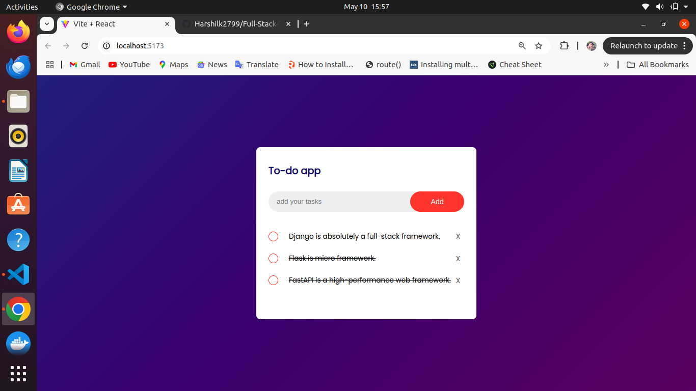

# 📝 Todo Application

A full-stack **Todo Application** built with **ReactJS (Frontend)** and **Django REST Framework (Backend)**. This app allows users to manage tasks efficiently with essential features like creating, reading, updating (complete), and deleting todo.

## 🚀 Features

- ✅ Create a Todo
- 📋 Read all Todos
- 🔁 Complete (Toggle) a Todo
- ❌ Delete a Todo

## 🛠️ Tech Stack

### Frontend

- ReactJS
- Axios

### Backend

- Django
- Django REST Framework
- CORS Headers

### Todo Application

